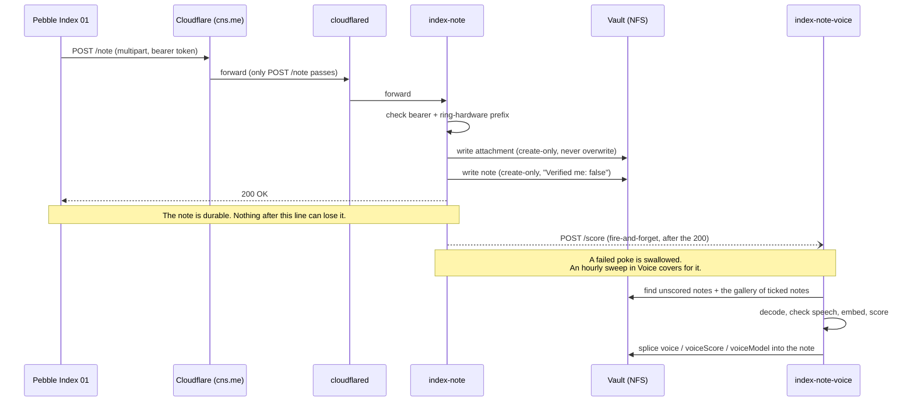
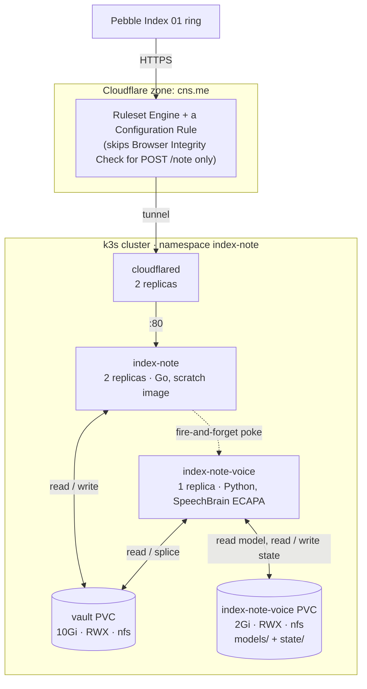
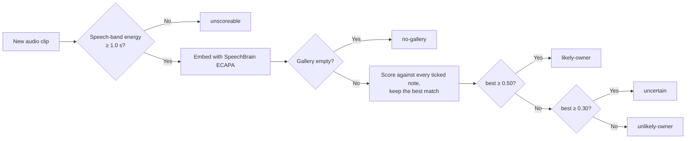

# index-note

[](https://github.com/chrisns/index-cf-note-queue/actions/workflows/build.yml)
[](https://github.com/chrisns/index-cf-note-queue/actions/workflows/build-voice.yml)
[](LICENSE)

index-note receives voice notes from a Pebble Index 01 ring. It writes them into an Obsidian vault. A second service scores each note for whether the speaker is the owner. It writes that score into the note as advisory metadata.

This README gives an overview. Two files hold the full specification. This project is built from them:

- **[SPEC.md](SPEC.md)**: the ingest service. It covers what the ring sends, the HTTP contract, and how a note lands safely on disk.
- **[VOICE.md](VOICE.md)**: the voice scorer. It covers how a clip is embedded, scored against a gallery, and how the result is recorded.

## Why it exists

The ring app has no retry. It sends one POST. On failure, it silently discards the recording. Every design decision in this repository follows from that one fact. See [SPEC.md section 1](SPEC.md#1-the-one-rule) for the full reasoning.

## How a note gets from the ring to the vault



Two things to notice:

1. The note is safe the moment the ingest service returns 200. Everything the voice scorer does happens afterwards. None of it can delay, endanger, or undo that 200.
2. A note is never gated, rejected, or held back because of its voice score. The score is metadata for a human to read later. It is never a control.

## What is deployed



There is no Ingress. There is no public route beyond `POST /note`. Neither service makes an outbound call, except the poke between them. That poke stays inside the cluster. `GET /healthz` on each service is for the kubelet only. The tunnel never publishes it.

Manifests live in a separate repository named `chrisns/infra`. Apply them by hand with `kubectl apply -k`. There is no GitOps controller. See [SPEC.md section 9](SPEC.md#9-kubernetes) and [VOICE.md section 4](VOICE.md#4-components).

## How a note gets a voice score



The gallery is exactly the set of notes the owner has ticked `Verified me: true` in Obsidian. Nothing joins the gallery automatically. Nothing leaves it automatically either. The owner's tick is the only way in. See [VOICE.md section 6](VOICE.md#6-the-gallery) for why. See section 11 for what is still unproven about these thresholds.

## Components

| Component | Language | Role | Directory |
|---|---|---|---|
| `index-note` | Go | Receives the webhook, authenticates it, writes the note and its audio | repository root |
| `index-note-voice` | Python | Scores each note's audio against a gallery of verified notes | [`voice/`](voice/) |

Each component builds to its own container image. Each has its own CI workflow. They change independently. The Python service carries heavy machine-learning dependencies. The Go service must never need them.

## Getting started

### index-note (Go)

```sh
go build ./...
go vet ./...
go test ./...
```

Golden-file tests live under `testdata/golden/`. Regenerate them after a deliberate frontmatter change with:

```sh
go test -run TestRenderGolden -update
```

Then review the diff before you commit it. A passing `-update` run proves the code produced *something*. It does not prove the code produced the *right* thing.

### index-note-voice (Python)

```sh
cd voice
uv sync            # fast: no torch or speechbrain, tests never need them
uv run pytest
uv run ruff check .
```

The `ml` dependency group holds `torch` and `speechbrain`. It stays separate on purpose. A plain `uv sync` then stays quick. Only the Docker image installs the `ml` group:

```sh
cd voice
uv sync --extra ml
```

## Configuration

Both services read their configuration from environment variables. Each one fails fast at startup if a required variable is missing or malformed. See [SPEC.md section 6.7](SPEC.md#67-startup-contract) for the ingest service's exact contract.

| Variable | Service | Purpose |
|---|---|---|
| `INDEX_BEARER_TOKENS` | index-note | Comma-separated valid bearer tokens, for rotation |
| `INDEX_RING_PREFIXES` | index-note | Comma-separated allowed recording-id prefixes, the ring's second factor. Never commit it |
| `VAULT_DIR` | both | The Obsidian vault |
| `VOICE_SCORER_URL` | index-note | Where to poke after a note is durable. Unset disables the poke entirely |
| `VOICE_MODEL_DIR` | index-note-voice | The mounted, pre-populated SpeechBrain model directory |
| `STATE_DIR` | index-note-voice | Cached embeddings and scores, kept outside the vault because an embedding is biometric data |

## Testing philosophy

There is no way to replay a real note. The first one that ever arrived was irreplaceable. So this repository builds its test fixtures by hand from the specification. The fixtures live under `testdata/`. Real captured data replaces them as it becomes available. See [SPEC.md section 11](SPEC.md#11-testing).

## License

[MIT](LICENSE)
